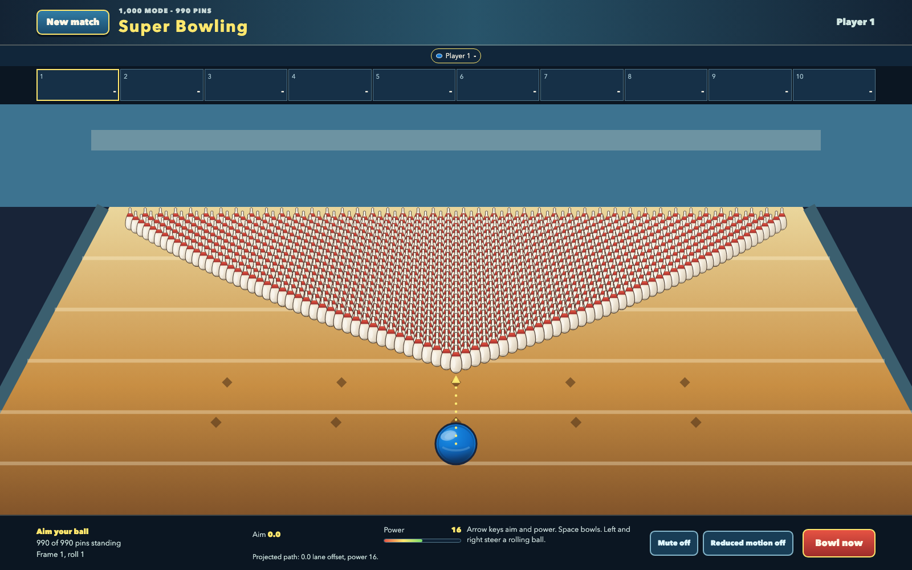
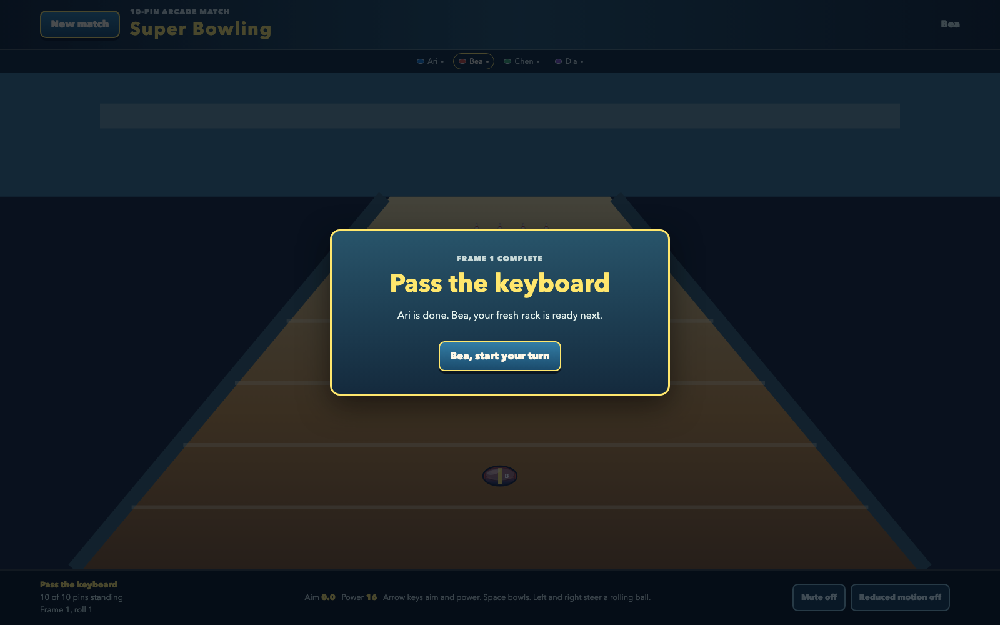

# Super Bowling

An original browser bowling game for friends sharing one keyboard, with
front-facing arcade lanes and complete triangular racks that grow from ten real pins to 990.

> **Playable now:** choose the 10, 20, 50, 100, 500, or 1,000 scale label for a complete
> one-to-four-player keyboard match with worker physics, Canvas rendering, generalized scoring,
> and custom balls.

<!-- screenshots:begin (managed by screenshot-docs) -->



<!-- screenshots:end -->

## One keyboard, giant rack

This is bowling for the moment when ten pins feel a little too sensible. Pick an exact
rack scale, pass the keyboard between up to four people, and send a custom rolling
ball toward a deck with hundreds of individually countable pins. Its circular
silhouette stays familiar while the selected surface pattern visibly rolls.

- Choose the convenient 10, 20, 50, 100, 500, or 1,000 scale label; setup and the HUD show the
  actual complete-triangle total used for play and scoring.
- Every rack forms one centered triangular deck with a head pin and complete rows 1, 2, 3, and onward.
- The super lane and deck widen with the selected rack so its ball and pins remain recognizable
  at every count.
- Play a familiar ten-frame bowling match whose strike, spare, and bonus values scale
  with the selected rack.
- Share one browser and keyboard with one to four local hot-seat players.
- Give each player a recognizable ball with two colors, a pattern, and an optional
  two-character monogram.
- Keep the presentation original: a faux-3D lane, Canvas rendering, and synthesized
  sound built for a 16:10 landscape browser.
- Keep the next local session ready with recent-player restore, per-rack best scores, mute,
  and reduced-motion preferences.

| Scale label | Actual pins |
| ----------: | ----------: |
|          10 |          10 |
|          20 |          21 |
|          50 |          45 |
|         100 |         105 |
|         500 |         496 |
|       1,000 |         990 |

## Current playable lane

The shipped game starts a complete-triangle match with one to four named players. Setup keeps
each player's colors, pattern, and optional monogram in the same production ball renderer used on
the lane. A focused pass-the-keyboard card advances each hot-seat turn, while the full score strip,
original pin and circular-ball art, projected aim path, worker-backed rolls, and
phase feedback stay visible.

## Quick start

Use Node.js with npm. The repository setup script installs the pinned browser-game
toolchain, and the web server builds then serves the same `dist/` artifact intended for
GitHub Pages.

```bash
./devel/setup_typescript.sh
./run_web_server.sh
```

Open the local URL printed by the server, choose a rack, add one to four players, and customize
their balls before starting the match.
Use arrow keys to set aim and power, press Space to bowl, and use Left/Right while rolling to
guide the ball. The setup and in-game controls keep Mute and Reduced motion choices visible.
Stop the server with `Ctrl-C`.
The preview session expires after 600 seconds; set `WEB_SERVER_MAX_LIFETIME_SECONDS` to a
positive whole-second value when a shorter or longer local session is useful.

## Controls and play

Every rack uses the same deliberately simple keyboard control scheme:

| Key          | Action                                                   |
| ------------ | -------------------------------------------------------- |
| Left / Right | Aim before launch; guide the ball gently while it rolls. |
| Up / Down    | Set bowling power before launch.                         |
| Space        | Bowl.                                                    |

The completed match follows classic strikes, spares, and tenth-frame bonus rolls.
The shared [docs/GAME_RULES.md](docs/GAME_RULES.md) contract generalizes the same rules to
every supported rack: a perfect game scores `30 * pin_count`.
Here `pin_count` is the displayed actual total, rather than the convenient scale label.

## Verify and build

Run the repository front doors to check the TypeScript code, create the static Pages
artifact, and exercise the browser shell headlessly.

```bash
./check_codebase.sh
./build_github_pages.sh
./run_playwright_tests.sh --build
npm run benchmark
```

`./build_github_pages.sh` writes the deployable site to `dist/`. The Playwright suite uses
a 1600 x 1000 headless viewport, matching the game's 16:10 desktop target.
`npm run benchmark` generates a local 30-shot rack report at
`artifacts/benchmark/simulation_benchmark.json`; `artifacts/` stays ignored.

## GitHub Pages setup

The repository includes [deploy-pages.yml](deploy-pages.yml), a user-copyable root GitHub Actions
workflow. Copy it to `.github/workflows/deploy-pages.yml` in GitHub, enable Pages for
the repository, and use the resulting deployment URL. The workflow sets up dependencies,
checks the codebase, builds `dist/`, and deploys the uploaded Pages artifact. A public demo
URL is not confirmed yet.

## Documentation

- [docs/active_plans/active/super_bowling_v1.md](docs/active_plans/active/super_bowling_v1.md)
  - Product decisions, milestone ownership, and acceptance evidence.
- [docs/SOLID_MODEL.md](docs/SOLID_MODEL.md)
  - Solid reactivity boundaries for the UI, Canvas renderer, and simulation worker.
- [docs/PLAYWRIGHT_USAGE.md](docs/PLAYWRIGHT_USAGE.md)
  - Run and extend the headless browser checks.
- [docs/E2E_TESTS.md](docs/E2E_TESTS.md)
  - Choose the appropriate test home for browser and non-browser workflows.
- [docs/COLOR_CONTRAST_ACCESSIBILITY.md](docs/COLOR_CONTRAST_ACCESSIBILITY.md)
  - Readability guidance for the game's high-energy interface.

## Roadmap status

M1 through M8 are delivered: the Solid shell and worker contracts, complete-triangle simulation
benchmark, full scoring match, generalized rack modes, hot-seat custom balls, and the audio,
save, camera, reduced-motion presentation, and the playability/geometry revision are all part
of the playable build. The final retained front doors pass 76 Node tests, the static Pages build,
all 22 headless browser journeys, and the 30-shot simulation benchmark across 10->10, 20->21,
50->45, 100->105, 500->496, and 1000->990. The benchmark release gate requires every sample to
settle without timeout while conserving pins and reporting finite measurements. The README
screenshots were visually inspected at the 1600 x 1000 target viewport.

The active plan is the source of truth for milestone status and evidence.
