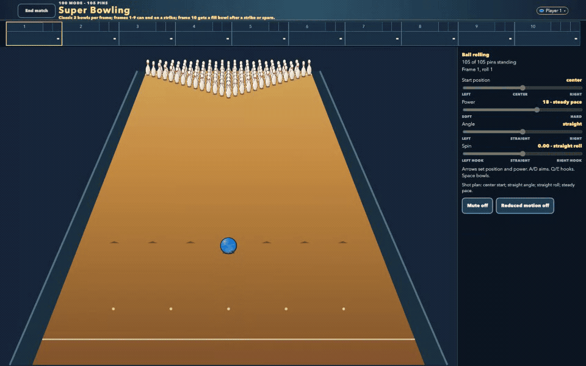
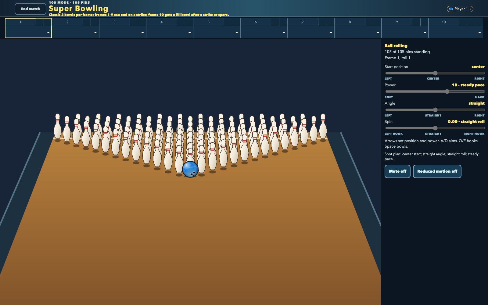
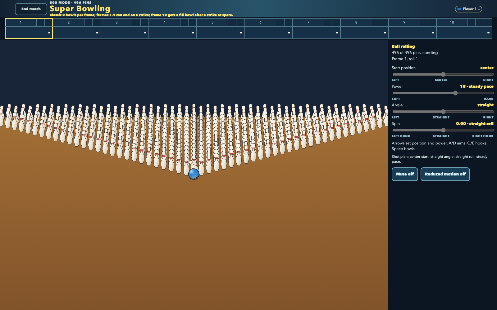
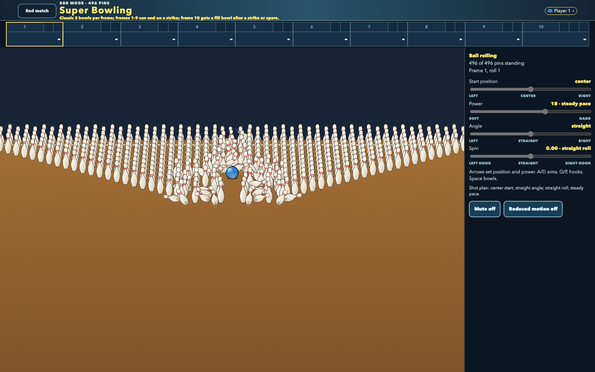
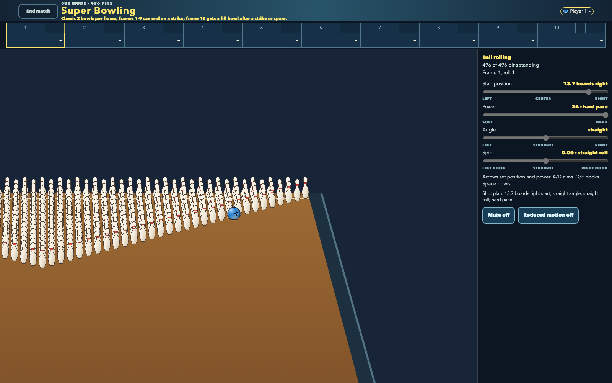
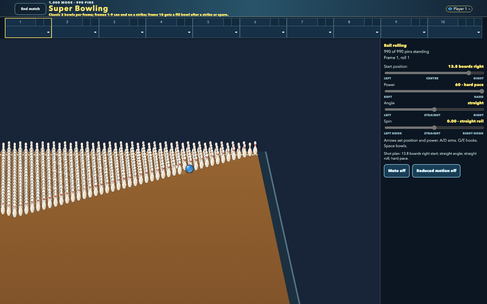
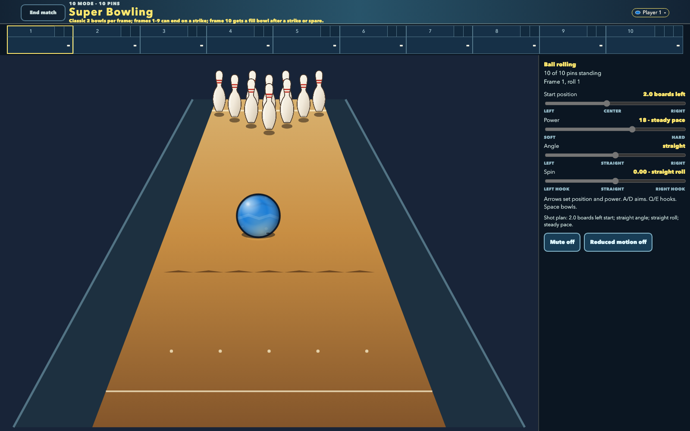
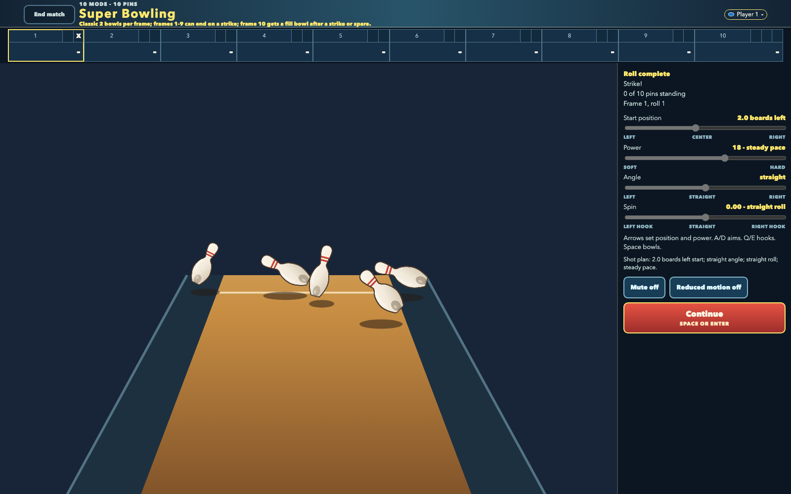
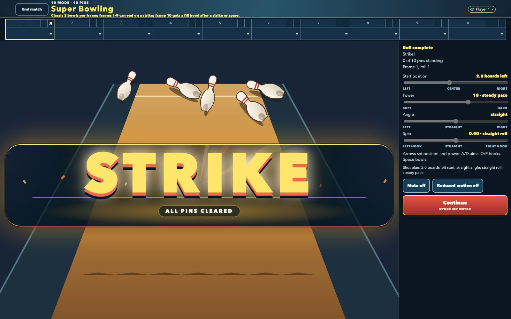
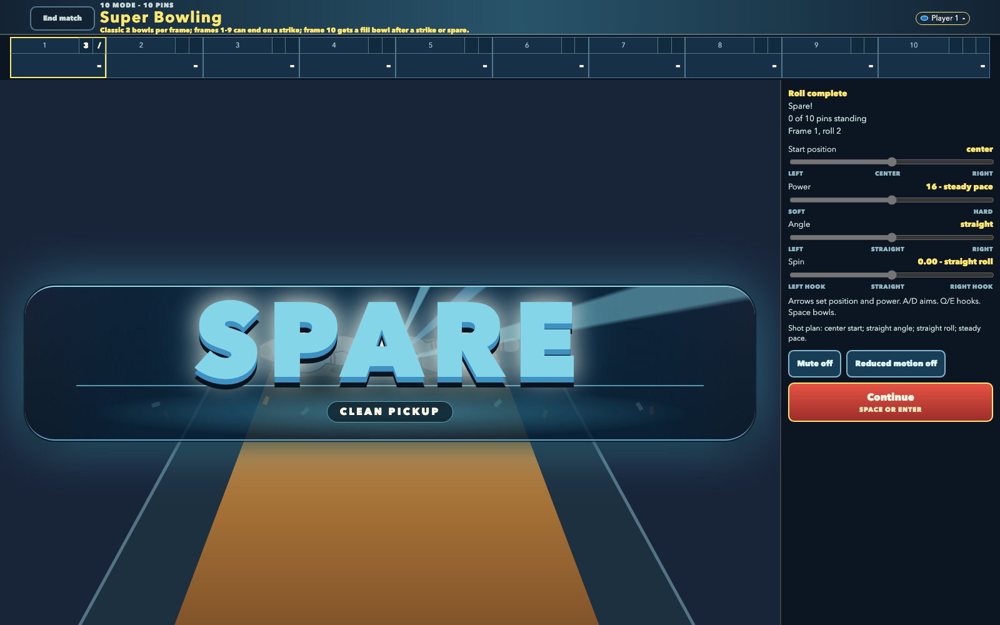

# Arcade moments

Super Bowling changes its visual emphasis with the scale and meaning of the shot. The 105-pin
frames keep individual reactions large, the 496-pin frames show the camera holding a local dense
collision, and the ten-pin view makes the rolling ball, physical aftermath, and earned result
unmistakable. The record and handoff frames show how the game returns from impact to useful player
information.

<!-- screenshots:begin (managed by screenshot-docs) -->

<!-- screenshots:end -->

The one-play 105-pin animation records the normal-motion browser build: release, first contact,
and a spreading physical cascade. Its static first-impact and cascade frames directly below give
the same readable outcome when animation is unavailable or lower motion is preferred.

The 496-pin frames add the intermediate dense-rack proof: the first authoritative contact and its
opening physical wave remain centered and readable without pulling the camera back to the complete
rack. The outside-entry 496- and 990-pin frames make that local ownership explicit: each camera
follows the ball to the collision it creates near the selected side rather than drifting back to
the complete-rack center.

The ten-pin ball frame proves the active renderer at a useful scale: glossy sphere lighting,
recessed holes, player surface pattern, and a lane contact shadow are visible in one ordinary
roll. The physical strike aftermath is a real player-legal pocket shot, not a score fixture; its
five retained deck pins show visibly different poses while the other five have entered the pit.
Strike and spare then take temporary lane authority with distinct amber and cyan identities. The
105-pin animation is one-play and the nearby static frames remain the reduced-motion fallback.
The BEST FRAME message remains above the physical outcome, and the local-player dialog makes the
next person and next action explicit without changing the bowling controls.

Return to the [README](../../README.md), or watch the larger event in the
[1,000-pin action tour](THOUSAND_PIN_ACTION.md).
