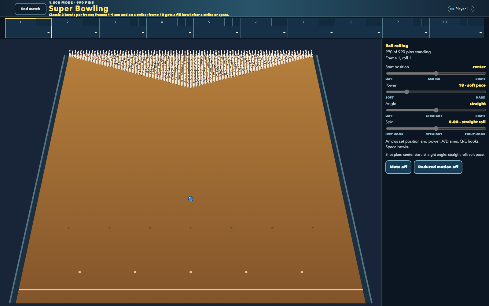
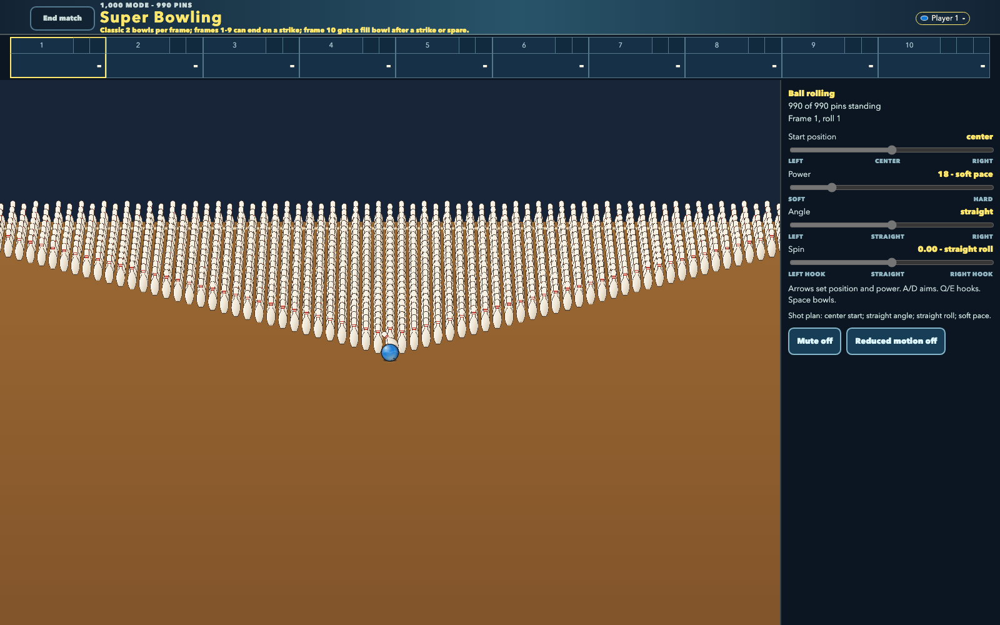
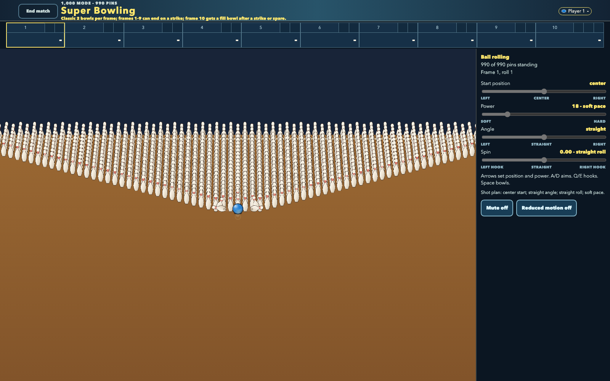
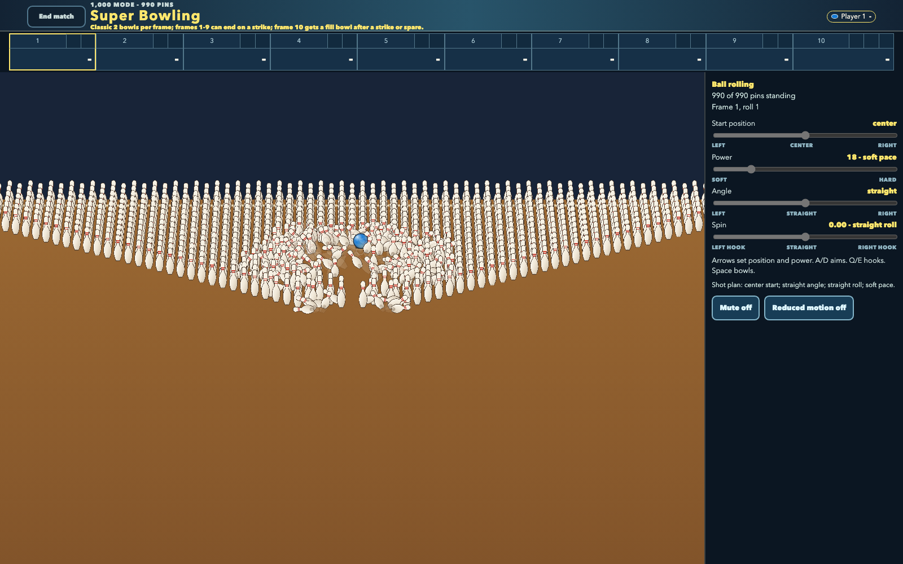
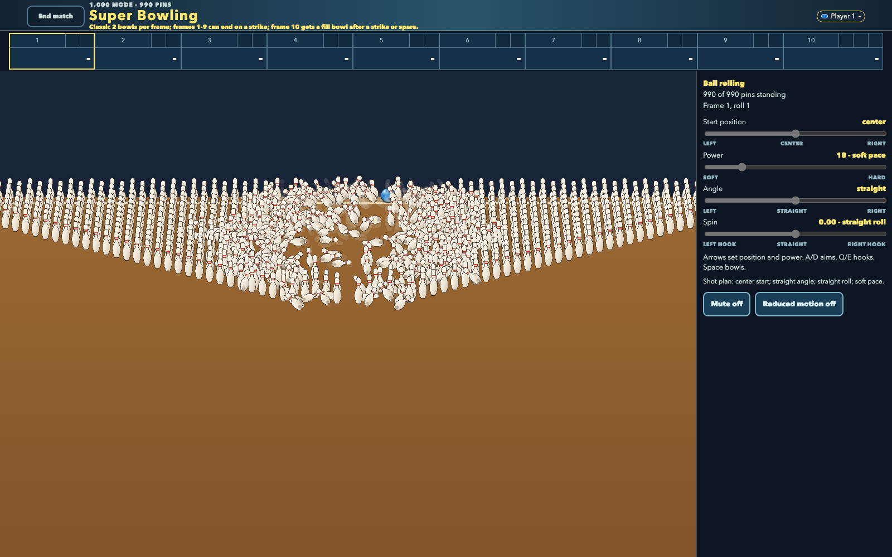
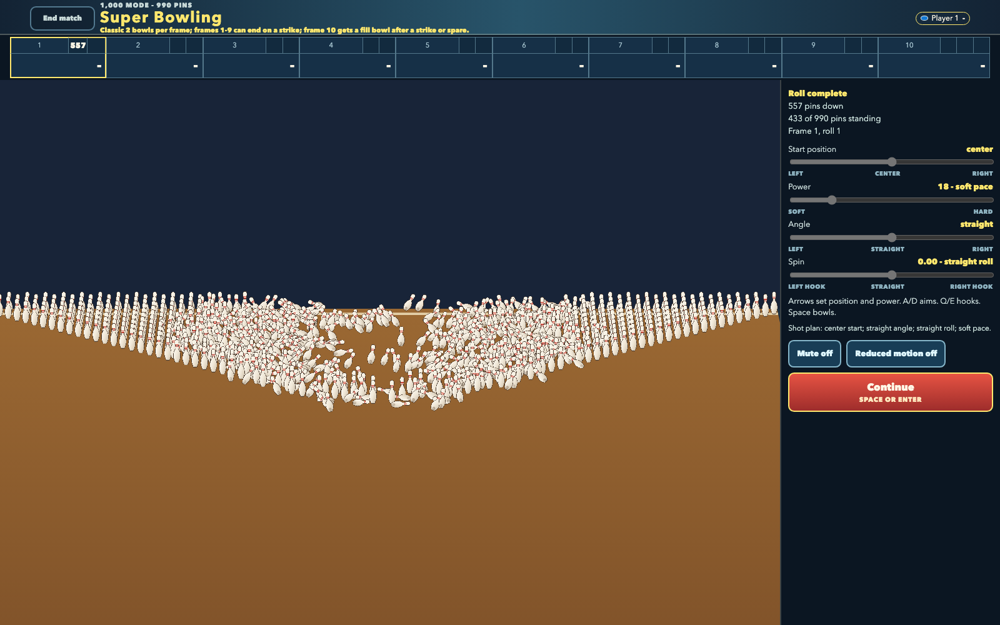

# 1,000-pin action

The 1,000-mode rack contains 990 individually simulated pins. These six 1600 x 1000 captures
follow one full-power centered roll through the shipped browser build and real Rapier worker.
They are frames from one physical event, not a staged particle effect or a reduced pin fixture.

<!-- screenshots:begin (managed by screenshot-docs) -->

<!-- screenshots:end -->

The quiet approach establishes the scale of the complete rack. At first contact the camera frames
the local neighborhood the ball actually enters; the full triangle is intentionally not an
impact-frame requirement. The moving region then spreads from that local physical event rather than
turning the rack into a uniform explosion. The settled result restores enough deck context to
compare the 557 fallen pins with the 433 that remain standing.

Return to the [README](../../README.md), or continue to the
[arcade moments gallery](ARCADE_MOMENTS.md).
